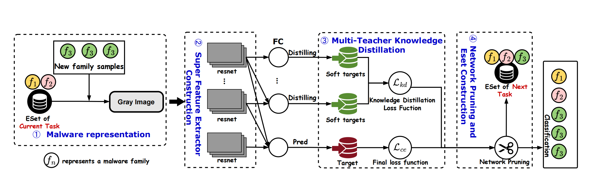

# KinDroid: A Self-Adaptive Incremental Learning Approach to Concept Drift of Android Malware Families

## Introduction

The increasing prevalence of Android malware makes effective classification and identification crucial for security. However, the emergence of new malware families may cause the change of malware characteristics, making it challenging for existing models to identify new threats, which is known as concept drift. Current solutions rely on full retraining to address this issue, which is time-consuming and requires a large number of labeled samples. To address this challenge, we propose a framework that utilizes adaptive multi-teacher knowledge distillation for the incremental classification of Android malware families, named KinDroid, allowing dynamic expansion of model representations. This approach ensures accurate classification of known families while enabling the effective learning of new families with only a small number of samples. By freezing previous representations, adding new feature dimensions, and performing model pruning after completing knowledge distillation, KinDroid effectively addresses potential redundancy issues in dynamic model expansion. We conduct rigorous evaluations of KinDroid on three datasets. After completing 10 incremental tasks, KinDroid achieves average accuracies of 99.79%, 77.23%, and 72.80%, significantly surpassing the performance of current state-of-the-art methods. The experimental results indicate that KinDroid successfully retains knowledge of previous categories while effectively learning new malware families, reducing the impact of concept drift.

## How To Use

### Run experiment

1. Edit the [MODEL NAME].json file for global settings.
2. Edit the hyperparameters in the corresponding  [MODEL NAME].py file (e.g., models/kindroid.py).
3. Run： python main.py --config=./exps/[MODEL NAME].json   To run our method  python main.py --config=./exps/kindroid.json.

### Datasets

There are three Android malware datasets: one is a widely used Android malware family dataset (AMD), and the other two are based on VirusShare datasets (VirusShareImg and VirusShareYearsImg). The datasets can be accessed [**here**](https://drive.google.com/drive/folders/1zRYfso7YJlm8SooZtosUkVHpsZw5ICr_?usp=drive_link).

**Virusshare.zip** is the **VirusShareImg** dataset, and **Virusshareyear.zip** is the **VirusShareYearsImg** dataset.

### Run
Before proceeding with the experiment, set up how the dataset is loaded in utils/data_manager.py:

In the **_setup_data** method, see the comment.

### Acknowledgments
This work is based on [**PyCIL**](https://github.com/G-U-N/PyCIL).

### Contact
If you have any questions, please contact the author Hongpeng Bai (bai931214@tju.edu.cn).
